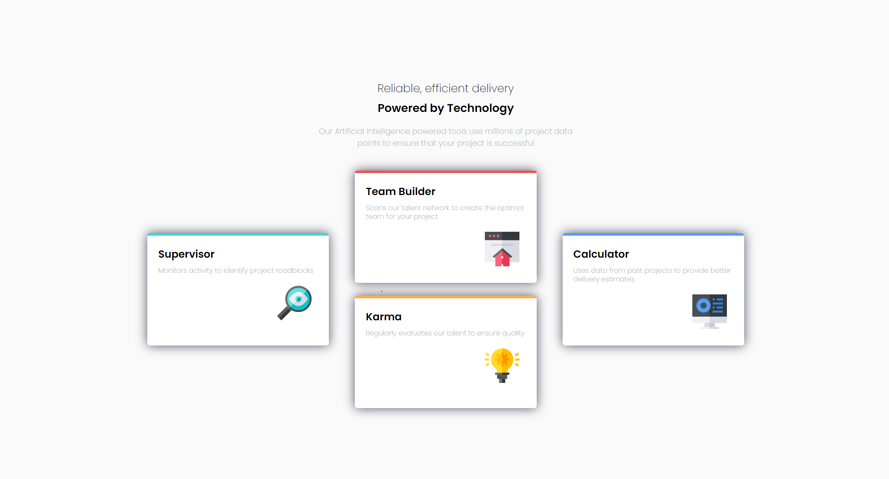
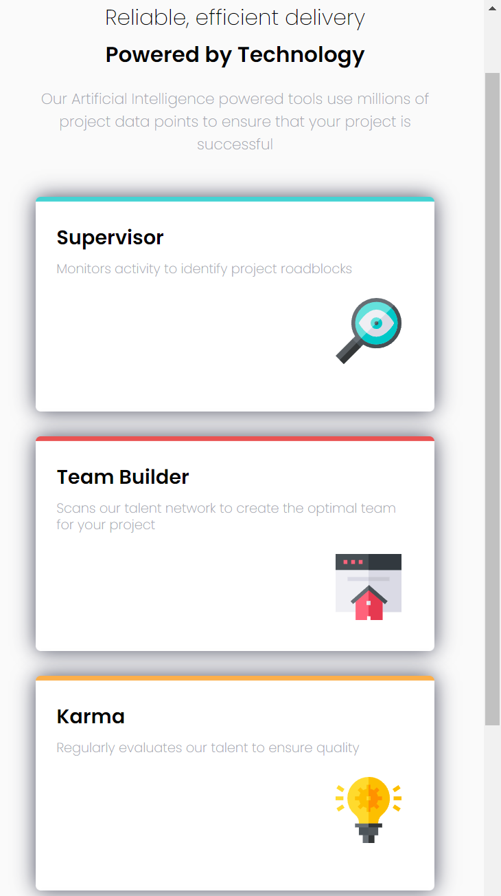

# Frontend Mentor - Four card feature section solution

This is a solution to the [Four card feature section challenge on Frontend Mentor](https://www.frontendmentor.io/challenges/four-card-feature-section-weK1eFYK). Frontend Mentor challenges help you improve your coding skills by building realistic projects. 

## Table of contents

- [Overview](#overview)
  - [The challenge](#the-challenge)
  - [Links](#links)
  - [Screenshot](#screenshot)
- [My process](#my-process)
  - [Built with](#built-with)
  - [Useful resources](#useful-resources)

## Overview

### The challenge

Users should be able to:

- View the optimal layout for the site depending on their device's screen size

### Links

- Live Site URL: [My Solution](https://fecrol.github.io/FourCardFeatureSection/)

### Screenshot

## My process

### Built with

- HTML5
- CSS3
- Flexbox
- Mobile-first workflow
- Responsive design

### Useful resources

- [CSS Tutorial - Zero to Hero (Complete Course)](https://www.youtube.com/watch?v=1Rs2ND1ryYc&t=13174s) - Fantastic course to learn CSS in-depth for free.